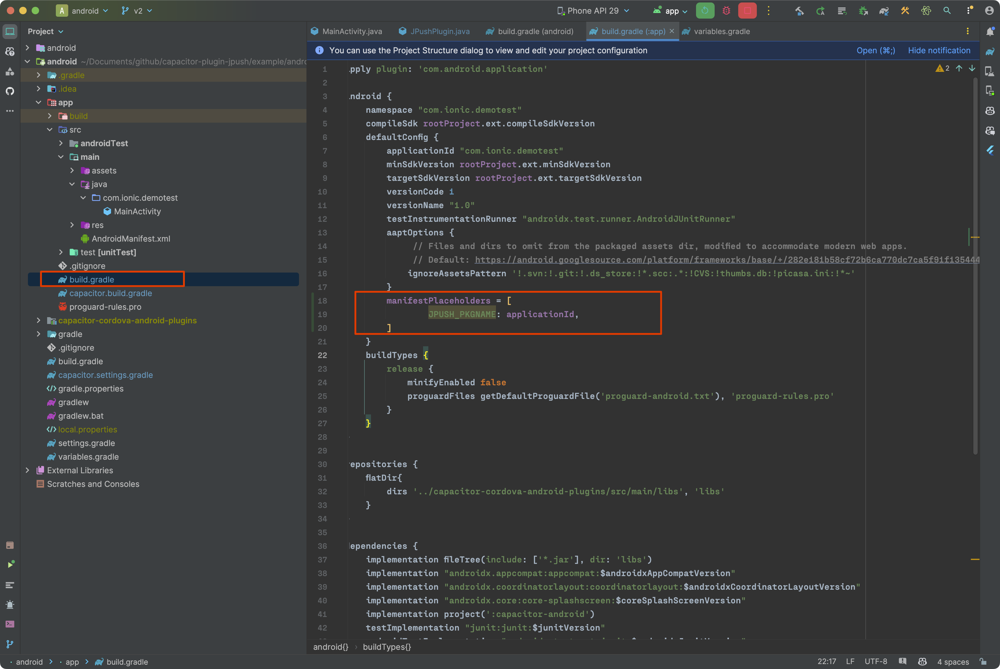

# capacitor-plugin-jpush

<p align="left">
  <a href="https://img.shields.io/badge/support-IOS-516BEB?logo=ios&logoColor=white&style=plastic">
    
  </a>
  <a href="https://img.shields.io/badge/support-Android-516BEB?logo=android&logoColor=white&style=plastic">
    
  </a>
  <a href="https://www.npmjs.com/package/capacitor-plugin-jpush">
    
  </a>
  <a href="https://www.npmjs.com/package/capacitor-plugin-jpush">
    
  </a>
</p>

简体中文 | [English](./README-EN.md)

一款基于 `Capacitor 3.0+` 的极光推送插件，如果有使用上的问题，欢迎提 `issue`，我会尽力解决，也欢迎贡献你的代码。 如果这个插件帮助到了你，请不要吝啬你的 `star`，万分感谢！！

- v0.x 版本支持 `Capacitor4` 及更早版本
- v1.0+ 版本支持 `Capacitor5`

> **重要更新** ：`0.x` 版本无需手动初始化极光推送服务，在 `capacitor.config.ts`中配置了 `appKey`，应用启动时便会自动注册极光服务。 `1.x` 版本开始需要手动调用 `startJPush` 方法注册极光服务。

> 关于产商通道：`Android` 目前暂未支持产商通道推送, 有兴趣开发的兄弟可以提PR

## 安装

```bash
npm install capacitor-plugin-jpush

npx cap sync
```

## 使用

在 `capacitor.config.ts` 配置你的极光推送 `Appkey` 等相关信息, 并且确保你的应用包名和极光后台设置的一致:

```ts
/// <reference types="capacitor-plugin-jpush" />

import { CapacitorConfig } from '@capacitor/cli';
const config: CapacitorConfig = {
  plugins: {
    JPush: {
      // your application appKey on JPush
      appKey: '',
      channel: '',
    },
  },
};

export default config;
```

或者在 `capacitor.config.json` 中配置:

```json
{
  "plugins": {
    "JPush": {
      "appKey": "",
      "channel": ""
    }
  }
}
```

### IOS设置

目前 `IOS` 的极光推送版本是 5.0.0，在 iOS 上，您必须启用推送通知功能。 详见 [Setting Capabilities](https://capacitorjs.com/docs/v4/ios/configuration#setting-capabilities) 文档如何启用推送功能（如未启用，会导致 `JPush` 无法注册 `deviceToken`）。

> 你本机的 Xcode 需要使用 Xcode 14 及以上版本，请注意升级！

在打开了推送通知功能之后, 添加以下代码到 `IOS` 应用的 `AppDelegate.swift` 文件:

```swift
import Foundation

func application(_ application: UIApplication, didRegisterForRemoteNotificationsWithDeviceToken deviceToken: Data) {
  NotificationCenter.default.post(name: .capacitorDidRegisterForRemoteNotifications, object: deviceToken)
}
func application(_ application: UIApplication, didFailToRegisterForRemoteNotificationsWithError error: Error) {
  NotificationCenter.default.post(name: .capacitorDidFailToRegisterForRemoteNotifications, object: error)
}

// 这个函数 capacitor 生成的项目中可能自带, 只需将里面的内容复制过去即可
func applicationDidBecomeActive(_ application: UIApplication) {
    NotificationCenter.default.post(name: Notification.Name(rawValue: "didBecomeActiveNotification"), object: nil)
}
```

然后找到极光推送的依赖包文件, 也就是 `JPUSHService.h`，点击此文件，在编辑器右边窗口找到 `Target MemberShip`，将 `CapacitorPluginJPush` 勾选中，并将它的值设置为 `Public` 如下图所示（如果没有找到该依赖文件，请在你的前端项目先运行命令 `npx cap sync ios`，如果是 `Ionic` 项目，则是运行 `ionic cap sync ios`）:


### Android设置

Android 13 之后系统必须要有推送通知权限才可以收到推送消息，所以你可以通过 `checkPermissions()` 方法来检查你的应用是否开启了通知权限，如果没有，则可以通过 `requestPermissions()` 来启用通知权限，如果用户拒绝了，可以通过调用 `openNotificationSetting()` 方法来打开通知权限设置页面，

在 Android 12 及更老的设备，系统默认启用推送通知权限。

在你安卓应用根目录下找到 `variables.gradle` 文件，将 `compileSdkVersion` 和 `targetSdkVersion` 值设置为 `33` ，如果已经是 `33` 以上 可以忽略此步骤;

在 android 项目中的 `build.gradle` 文件中加入以下变量配置(注意是 app 文件夹下的`build.gradle`):

```bash
defaultConfig {
  ...
  manifestPlaceholders = [
    JPUSH_PKGNAME: applicationId,
  ]
}
```



## 代码示例

```ts
import { Capacitor } from '@capacitor/core';
import { JPush } from 'capacitor-plugin-jpush';

const JPushSetup = async () => {
  if (Capacitor.isNativePlatform()) {
    // 推送事件监听
    const receivedEvent = await JPush.addListener('notificationReceived', (data) => {
      console.log(data);
    });
    // 若不需要监听，移除即可
    receivedEvent.remove();

    JPush.addListener('notificationOpened', (data) => {
      console.log(data);
    });

    // 检测是否有通知权限
    JPush.checkPermissions().then(async ({ permission }) => {
      console.log(permission);
      if (permission !== 'granted') {
        // 申请通知权限
        JPush.requestPermissions().then(async (res) => {
          console.log(res.permission);
          if (res.permission === 'granted') {
            // 初始化极光推送
            await JPush.startJPush();
          }
        });
        return;
      }
      // 初始化极光推送
      await JPush.startJPush();
    });
  }
};

const JPushMethods = async () => {
  // 设置推送别名
  await JPush.setAlias({
    alias: 'alias',
  });

  // getRegistrationID
  const { registrationId } = await JPush.getRegistrationID();
  console.log(registrationId);

  // ......
};
```

## API

<docgen-index>

- [`startJPush()`](#startjpush)
- [`setDebugMode(...)`](#setdebugmode)
- [`setAlias(...)`](#setalias)
- [`deleteAlias(...)`](#deletealias)
- [`addTags(...)`](#addtags)
- [`deleteTags(...)`](#deletetags)
- [`cleanTags()`](#cleantags)
- [`setBadgeNumber(...)`](#setbadgenumber)
- [`removeListeners()`](#removelisteners)
- [`getRegistrationID()`](#getregistrationid)
- [`checkPermissions()`](#checkpermissions)
- [`requestPermissions()`](#requestpermissions)
- [`openNotificationSetting()`](#opennotificationsetting)
- [`addListener('notificationReceived', ...)`](#addlistenernotificationreceived)
- [`addListener('notificationOpened', ...)`](#addlistenernotificationopened)
- [Interfaces](#interfaces)
- [Type Aliases](#type-aliases)

</docgen-index>

<docgen-api>
<!--Update the source file JSDoc comments and rerun docgen to update the docs below-->

### startJPush()

```typescript
startJPush() => Promise<void>
```

启动极光推送服务，即使没有获取到通知权限，也会进行推送服务初始化

---

### setDebugMode(...)

```typescript
setDebugMode(isDebug: boolean) => Promise<void>
```

开启 debug 模式 log日志

| Param         | Type                 |
| ------------- | -------------------- |
| **`isDebug`** | <code>boolean</code> |

---

### setAlias(...)

```typescript
setAlias(options: AliasOptions) => Promise<void>
```

设置推送别名，可作为推送消息的目标对象

| Param         | Type                                                  |
| ------------- | ----------------------------------------------------- |
| **`options`** | <code><a href="#aliasoptions">AliasOptions</a></code> |

---

### deleteAlias(...)

```typescript
deleteAlias(options?: DeleteAlias | undefined) => Promise<void>
```

删除推送别名

| Param         | Type                                                |
| ------------- | --------------------------------------------------- |
| **`options`** | <code><a href="#deletealias">DeleteAlias</a></code> |

---

### addTags(...)

```typescript
addTags(options: SetTagsOptions) => Promise<void>
```

设置推送标签

| Param         | Type                                                      |
| ------------- | --------------------------------------------------------- |
| **`options`** | <code><a href="#settagsoptions">SetTagsOptions</a></code> |

---

### deleteTags(...)

```typescript
deleteTags(options: SetTagsOptions) => Promise<void>
```

删除推送标签

| Param         | Type                                                      |
| ------------- | --------------------------------------------------------- |
| **`options`** | <code><a href="#settagsoptions">SetTagsOptions</a></code> |

---

### cleanTags()

```typescript
cleanTags() => Promise<void>
```

---

### setBadgeNumber(...)

```typescript
setBadgeNumber(options?: SetBadgeNumberOptions | undefined) => Promise<void>
```

设置 APP 角标数字，设为 0 即清空角标

| Param         | Type                                                                    |
| ------------- | ----------------------------------------------------------------------- |
| **`options`** | <code><a href="#setbadgenumberoptions">SetBadgeNumberOptions</a></code> |

---

### removeListeners()

```typescript
removeListeners() => Promise<void>
```

---

### getRegistrationID()

```typescript
getRegistrationID() => Promise<{ registrationId: string; }>
```

获取设备的注册 ID，若服务重新注册，则返回的 ID 是不一样的

**Returns:** <code>Promise&lt;{ registrationId: string; }&gt;</code>

---

### checkPermissions()

```typescript
checkPermissions() => Promise<PermissionStatus>
```

检查通知权限状态

**Returns:** <code>Promise&lt;<a href="#permissionstatus">PermissionStatus</a>&gt;</code>

---

### requestPermissions()

```typescript
requestPermissions() => Promise<PermissionStatus>
```

申请通知权限

**Returns:** <code>Promise&lt;<a href="#permissionstatus">PermissionStatus</a>&gt;</code>

---

### openNotificationSetting()

```typescript
openNotificationSetting() => Promise<void>
```

打开推送通知权限设置页面（目前仅安卓支持）

---

### addListener('notificationReceived', ...)

```typescript
addListener(eventName: 'notificationReceived', listenerFunc: (notificationData: ReceiveNotificationData) => void) => Promise<PluginListenerHandle> & PluginListenerHandle
```

监听推送消息

| Param              | Type                                                                                                       |
| ------------------ | ---------------------------------------------------------------------------------------------------------- |
| **`eventName`**    | <code>'notificationReceived'</code>                                                                        |
| **`listenerFunc`** | <code>(notificationData: <a href="#receivenotificationdata">ReceiveNotificationData</a>) =&gt; void</code> |

**Returns:** <code>Promise&lt;<a href="#pluginlistenerhandle">PluginListenerHandle</a>&gt; & <a href="#pluginlistenerhandle">PluginListenerHandle</a></code>

---

### addListener('notificationOpened', ...)

```typescript
addListener(eventName: 'notificationOpened', listenerFunc: (notificationData: ReceiveNotificationData) => void) => Promise<PluginListenerHandle> & PluginListenerHandle
```

监听消息栏通知被点击

| Param              | Type                                                                                                       |
| ------------------ | ---------------------------------------------------------------------------------------------------------- |
| **`eventName`**    | <code>'notificationOpened'</code>                                                                          |
| **`listenerFunc`** | <code>(notificationData: <a href="#receivenotificationdata">ReceiveNotificationData</a>) =&gt; void</code> |

**Returns:** <code>Promise&lt;<a href="#pluginlistenerhandle">PluginListenerHandle</a>&gt; & <a href="#pluginlistenerhandle">PluginListenerHandle</a></code>

---

### Interfaces

#### AliasOptions

| Prop           | Type                |
| -------------- | ------------------- |
| **`alias`**    | <code>string</code> |
| **`sequence`** | <code>number</code> |

#### DeleteAlias

| Prop           | Type                |
| -------------- | ------------------- |
| **`sequence`** | <code>number</code> |

#### SetTagsOptions

| Prop       | Type                  |
| ---------- | --------------------- |
| **`tags`** | <code>string[]</code> |

#### SetBadgeNumberOptions

| Prop        | Type                |
| ----------- | ------------------- |
| **`badge`** | <code>number</code> |

#### PermissionStatus

| Prop             | Type                                                        | Description                                                                                               |
| ---------------- | ----------------------------------------------------------- | --------------------------------------------------------------------------------------------------------- |
| **`permission`** | <code><a href="#permissionstate">PermissionState</a></code> | prompt: 首次申请，询问。 prompt-with-rationale： 每次都询问。 granted： 已获取权限。 denied：权限已拒绝。 |

#### PluginListenerHandle

| Prop         | Type                                      |
| ------------ | ----------------------------------------- |
| **`remove`** | <code>() =&gt; Promise&lt;void&gt;</code> |

#### ReceiveNotificationData

| Prop           | Type                                                                                                                                  |
| -------------- | ------------------------------------------------------------------------------------------------------------------------------------- |
| **`title`**    | <code>string</code>                                                                                                                   |
| **`content`**  | <code>string</code>                                                                                                                   |
| **`subTitle`** | <code>string</code>                                                                                                                   |
| **`rawData`**  | <code>{ [x: string]: any; aps: { alert: { body: string; subTitle: string; title: string; }; badge: number; sound: string; }; }</code> |

### Type Aliases

#### PermissionState

<code>'prompt' | 'prompt-with-rationale' | 'granted' | 'denied'</code>

</docgen-api>
